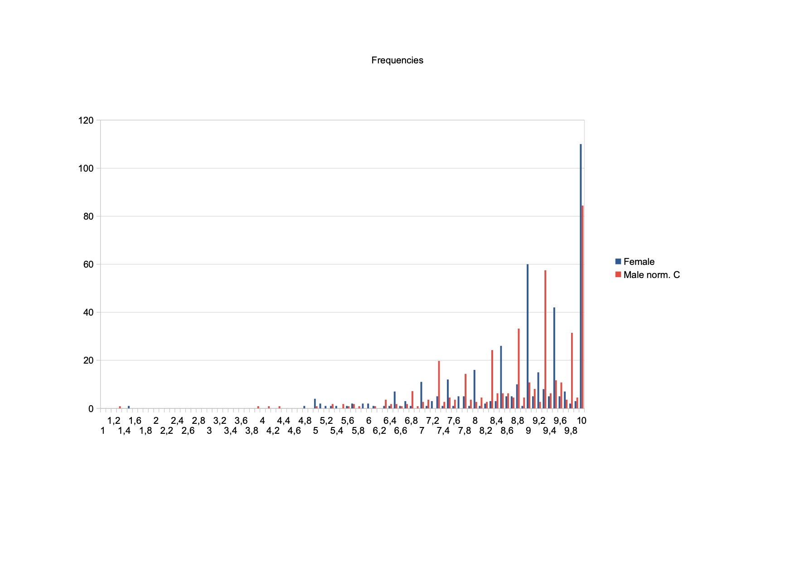

# Comentarios sobre estudio estadístico de sesgos en educación

1. Exposición del problema
    1. [Encuesta en X](#encuesta-en-x)
    2. [Fuente del estudio](#fuente-del-estudio)
    3. [Analogías](#analogías)
    4. [Origen de los sesgos](#origen-de-los-sesgos)
    5. [Medidas contra los sesgos](#medidas-contra-los-sesgos)
2. Comentarios sobre el estudio
    1. [Objetivo de estos comentarios](#objetivo-de-estos-comentarios)
    2. [Resultados del estudio](#resultados-del-estudio)
    3. [Frecuencias](#frecuencias)
    4. [Frecuencias normalizadas](#frecuencias-normalizadas)
    5. [Curiosidades](#curiosidades)
3. Ejemplo de compensación
    1. [Cuantía de la compensación](#cuantía-de-la-compensación)
    2. [Efecto de la compensación](#efecto-de-la-compensación)
    3. [Recepción de la compensación](#recepción-de-la-compensación)

## 1. Exposición del problema

### Encuesta en X

El usuario de X bouenmatrix ha hecho una encuesta en [este hilo](https://x.com/bouenmatrix/status/1820777679127233014) preguntando a la gente si le parece bien que se suba la nota a los chicos para compensar el sesgo que según un estudio tienen los profesores en España al evaluar exámenes.

Copio aquí el comienzo del hilo:

> Según este estudio reciente sobre el sesgo de los maestros en España:
>
> - Por debajo del 6, niños y niñas reciben la misma nota por el mismo examen.
>
> - Pero por encima del 6, a las niñas se les empieza a inflar la nota en un 10%. https://publications.jrc.ec.europa.eu/repository/bitstream/JRC136851/JRC136851_01.pdf

> Para que quede más claro:
>
> - Si un chico y una chica hacen un examen de 7, él saca un 7 pero ella un 7,1.
>
> - Si hacen un examen de 8, él saca un 8 y ella un 8,2.
>
> - Si hacen un examen de 9, él saca un 9 y ella un 9,3.

> Teniendo en cuenta lo anterior, aquí viene la pregunta:

> ¿Os parecería bien que en el colegio de vuestros hijos se aplicase automáticamente un algoritmo compensatorio; de forma que por ejemplo, todos los exámenes realizados por un chico y con nota de 8, pasasen a tener un 8,2?

Yo creo que el estudio no dice exactamentemente eso, pero, antes de comentarlo, voy a mencionar un par de analogías y algunas cuestiones sobre sesgos y compensaciones.

### Fuente del estudio

Gil Hernandez, C., Pañeda-Fernández, I., Salazar, L. and Castaño Muñoz, J., Teacher Bias in Assessments by Student Ascribed Status: A Factorial Experiment on Discrimination and Cultural Reproduction, European Commission, 2024, JRC136851.

El estudio puede descargarse en [https://publications.jrc.ec.europa.eu/repository/bitstream/JRC136851/JRC136851_01.pdf](https://publications.jrc.ec.europa.eu/repository/bitstream/JRC136851/JRC136851_01.pdf).

El propio estudio incluye un enlace en el que puede accederse al conjunto de datos del experimento:

Carlos J. Gil Hernandez; Leire Salazar; Jonatan Castaño Muñoz; Irene Pañeda-Fernandez (2023): Teacher's Bias Dataset: A Factorial Survey Experiment. European Commission, Joint Research Centre (JRC) [Dataset] PID: [http://data.europa.eu/89h/f14f5209-f032-4218-a89a-4643143809af](http://data.europa.eu/89h/f14f5209-f032-4218-a89a-4643143809af)

### Analogías

En [otro hilo](https://x.com/bouenmatrix/status/1820849511847039319), Bou hace otra encuesta que considera equivalente a la del hilo anterior, pero que muchos usuarios interpretan como un caso completamente diferente. 

No voy a discutir esa analogía aquí. En su lugar, voy a proponer otra analogía que a mí me parece más próxima, con una situación ficticia:

> Tras registrar 900 lanzamientos de un mismo dado en juegos de la oca, un estudio ha observado que los hombres han obtenido un promedio de 3,5 y las mujeres un promedio de 3,6. Es decir, cada mujer en promedio ha avanzado 36 casillas por cada 35 casillas que ha avanzado un hombre.
>
> ¿Se debería en el futuro establecer que los hombres deben adelantarse una casilla más cada vez que acumulan 35 casillas avanzadas?

Aunque parezcan muy distintas, ambas propuestas buscan conseguir que la media de resultados de los hombres sea lo más próxima posible a la de las mujeres, pero sin preocuparse de otros indicadores estadísticos ni indagar en la causa de los sesgos encontrados. Las diferencias entre los dos problemas ilustran precisamente la existencia de otros indicadores que pueden llegar a tener más peso que el sesgo:

* En el caso de los dados, la media esperada es exactamente 3,5; en el caso de las calificaciones, no hay media esperada a priori, la única media que tendremos es la que resulte del experimento.
* En el caso de los dados, el resultado ideal es aquel en el que todos los valores posibles tienen exactamente la misma frecuencia; en el caso de las calificaciones, el resultado ideal es aquel en el que, para igual desempeño, todos los valores tienen frecuencia cero excepto cierta calificación ideal, que tiene frecuencia igual al número de estudiantes con ese desempeño. Sin embargo, el estudio no solo no busca acercarse a este resultado ideal, sino que establece condiciones que favorecen una alta dispersión de los datos para hacer más evidentes los sesgos.

### Origen de los sesgos

Si tras la toma de datos nos encontramos con un sesgo en los resultados, podemos atribuirlo a muchas causas distintas, pero estas pueden agruparse en tres tipos no excluyentes:

* Azar: siempre va a haber un cierto sesgo por la propia naturaleza aleatoria del fenómeno. Este sesgo se mitiga aumentando el tamaño de la muestra.
* Experimento: el diseño, preparación y ejecución del experimento puede crear sesgos en los resultados. Estos son los sesgos que nos interesa eliminar para sacar conclusiones correctas de nuestro estudio.
* Realidad: el propio objeto que estamos estudiando puede tener sesgos. Estos son los sesgos que nos interesa conocer y, si son perjudiciales, remediar.

Para poder confiar en que hemos diagnosticado correctamente un sesgo presente en la realidad, tenemos que confiar en que hemos reducido suficientemente los sesgos propios del azar y del experimento.

### Medidas contra los sesgos

Una vez que hemos determinado que un sesgo indeseable está presente en la realidad, nos podemos plantear tomar medidas para evitarlo.

La solución preferible es averiguar las causas últimas que originan el sesgo y eliminarlas. Pero en el problema que se ha planteado aquí no sabemos cómo averiguar esas causas. Es un sesgo que conocemos solo por medios estadísticos.

Lo que se ha propuesto es dar una compensación general al grupo perjudicado que compense el sesgo. Ha surgido el debate sobre si esta compensación es ética, si es eficaz y si puede causar más problemas de los que resuelve.

## 2. Comentarios sobre el estudio

### Objetivo de estos comentarios

He intervenido brevemente en el debate generado. Los puntos principales de mi intervención han sido:

* cuestionar si los sesgos encontrados están presentes en la realidad o son fruto del azar o propios del experimento,
* señalar que el tipo de examen calificado en el experimento tiene un carácter extremadamente subjetivo,
* subrayar que el sesgo encontrado es pequeño comparado con la dispersión de los resultados.

Para ahondar más en las consecuencias del experimento, he seguido jugando con los datos y he tratado de valorar su significado. Estos comentarios me sirven para poner en orden mis ideas. Los publico por si a alguien más le sirven de alguna ayuda, pero hay que tener en cuenta las siguientes advertencias:

* Solo tengo nociones muy básicas de estadística. Quien quiera profundizar en el tema o hacer su propio análisis, tiene arriba enlaces al estudio y datos originales.
* Puedo haberme equivocado al hacer los números. De nuevo, arriba está el enlace a los datos originales para quien quiera hacer sus propios cálculos.
* Estos comentarios deberían verse como aclaraciones, puntualizaciones y elucubraciones. No dan ninguna respuesta definitiva sobre la validez de las conclusiones del estudio ni sobre la encuesta de Bou.
* El texto del estudio me ha aburrido enormemente y no he sido capaz de leerlo con gran detalle. Me he centrado en los datos brutos y en los indicadores estadísticos más comunes.

### Resultados del estudio

Antes de hablar de los resultados, voy a mencionar algunas conclusiones que en mi opinión, no pueden extraerse del artículo con suficiente confianza:

1. En el primer hilo de Bou, aunque no lo dice explícitamente, se puede entender que el sesgo encontrado en el estudio puede extrapolarse a cualquier tipo de examen. En realidad, el estudio solo recoge las calificaciones otorgadas a un examen concreto: una redacción. No he encontrado ningún indicio de que haya habido instrucciones claras sobre cómo valorar la redacción, lo cual haría esta valoración mucho más subjetiva que la de casi cualquier otro tipo de examen. Es decir, el estudio no demuestra que haya sesgo sistemático en condiciones distintas de las del experimento, y mucho menos que el valor del sesgo alcance en la práctica el mismo valor que en el experimento, que obviamente busca crear las condiciones extremas que permitan detectar sesgos sutiles.
2. Otra conclusión dudosa es la relación del sesgo con la puntuación del examen. A efectos de sesgo por razón de sexo, solo hay dos exámenes: uno con puntuación media de 5,9 y otro con puntuación media de 8,7. La relación sesgo-puntuación requiere asumir una hipótesis difícil de demostrar: que la distribución de calificaciones por múltiples profesores evaluando uno de dos desempeños posibles es equivalente a la distribución de calificaciones por un mismo profesor con sesgo promedio corrigiendo una gama de múltiples desempeños con calificaciones entre 1 y 10.

En adelante, me voy a centrar en el sesgo que aparece en la redacción cuya nota media es 8,7. Estos son los principales indicadores:

* Global
    * Población: 871
    * Media: 8,7
    * Moda: 10
    * Desviación típica: 1,26
* Chicas
    * Población: 412
    * Media: 8,83
    * Moda: 10
    * Desviación típica: 1,25
* Chicos
    * Población: 459
    * Media: 8,58
    * Moda: 10
    * Desviación típica: 1,26

Vemos que las chicas tienen en promedio una calificación 0,13 veces mayor que la media global. Los chicos tienen una calificación 0,12 veces menor que la media global.

Estas diferencias son mucho menores que la desviación típica. Esto no significa que el sesgo no sea real. De hecho, la subjetividad de la evaluación, que es lo que genera una desviación típica tan alta, es probablemente intencionada para poder detectar los sesgos más sutiles. Sin embargo, esto mismo hace que los sesgos encontrados, como cualquier efecto mucho menor que la desviación típica, haya que interpretarlos con cautela.

El hecho de que la moda sea mucho mayor que la media nos dice ya, sin necesidad de ver la gráfica, que los datos no se distribuyen en forma de campana de Gauss. Aun así, podemos seguir considerando la desviación típica como un buen indicador de la dispersión de los datos.

### Frecuencias

Aquí podemos ver una representación de la frecuencia de cada puntuación, con precisión de décimas de punto. Vemos que en efecto hay una gran dispersión de los datos. Debe recordarse que esto son calificaciones dadas por distintos profesores a redacciones idénticas. El alumno que ha obtenido un 1 ha presentado la misma redacción que los alumnos que han obtenido 10.

### Frecuencias normalizadas

En la gráfica anterior tenemos un problema: hay una diferencia no desdeñable entre las poblaciones femenina (412) y masculina (459), por lo que las frecuencias masculinas están sobrestimadas frente a las femeninas. Para que las frecuencias sean comparables, he multiplicado las masculinas por un mismo factor de corrección que iguala las poblaciones de ambos sexos sin modificar la proporción entre las distintas puntuaciones. La gráfica queda así:

### Curiosidades

Unas cuantas cosas llaman la atención en la gráfica:

* La nota más común tanto en chicos como en chicas es 10.
* La mayoría de profesores prefieren poner notas enteras o con cinco décimas.
* Muchas más chicas que chicos tienen 10.
* Bastantes más chicas que chicos tienen 9,5.
* Hay poca diferencia entre chicos y chicas que tienen 9.
* Bastantes más chicos que chicas tienen 8,5.
* Bastantes más chicos que chicas tienen 8.
* Hay poca diferencia entre chicos y chicas que tienen 7,5.
* Bastantes más chicos que chicas tienen 7.
* La principal responsable del sesgo parece ser el exceso de chicas (o defecto de chicos) con puntuación 10.
* La diferencia entre chicos y chicas que tienen 10 podría explicarse de varias formas (sin incluir casualidad):
    * Podría haber unos 39 profesores que pusieron 10 a una chica pero habrían puesto menos de 10 a un chico.
    * Podría haber unos 44 profesores que pusieron menos de 10 a un chico pero habrían puesto 10 a una chica (el número es mayor que en el caso anterior porque hay más chicos que chicas y no he aplicado aquí el factor de corrección).
    * Podría haber algunos profesores que pusieron 10 a una chica pero habrían puesto menos de 10 a un chico y otros profesores que pusieron menos de 10 a un chico pero habrían puesto 10 a una chica.

## 3. Ejemplo de compensación

### Cuantía de la compensación

La propuesta de la encuesta era puntuar más a los chicos en todos los exámenes en los que tengan una puntuación por encima de 6. Paso de momento por alto la cuestión de si los resultados del estudio son extrapolables a cualquier tipo de examen. En vez de eso, voy a hacer una prueba de cómo afectaría una compensación a los propios datos obtenidos en el estudio.

He probado dos tipos de compensación: una compensación uniforme de 3 décimas para todos los chicos independientemente de su puntuación, lo que simplemente busca igualar la nota media de las chicas con la de los chicos, y una compensación progresiva a partir de 6, que es la que propone la encuesta para corregir un sesgo que se supone variable según la puntuación.

### Efecto de la compensación uniforme

Aquí podemos ver la grafica de frecuencias después de aplicar la compensación de regalar 3 décimas a todos los chicos (con la excepción de los que tienen 9,8 o más, a quienes simplemente les ponemos 10).

Hemos conseguido igualar la media y hemos conseguido reducir la diferencia entre chicos y chicas que han obtenido 10, pero esta diferencia sigue siendo muy grande. Los chicos que nos faltaban con puntuación 10 siguen sin haber llegado, porque 3 décimas más atrás no había suficientes chicos. Podríamos quizá disminuir más estos sesgos locales haciendo lo que sugería la encuesta: usar compensaciones distintas según la nota de acuerdo con la fórmula propuesta. Todo depende de en qué punto nos demos por satisfechos en nuestro afán por reducir los sesgos estadísticos. Si nos conformamos con eliminar el sesgo de la media, ya ha quedado resuelto.

Sin embargo, salvo que invalidemos completamente la evaluación y demos 10 a todo el mundo, nunca vamos a conseguir que se elimine el principal problema que estos datos supondrían si se dieran en un aula real: el hecho de que exámenes idénticos obtienen calificaciones muy distintas.

Antes de la compensación, más del 57% de la población total tenía como mínimo un punto menos que los que consiguieron la máxima nota con idéntico desempeño. Después de la compensación, solo hemos conseguido reducir esta cifra hasta el 48,6%. En el caso de la población femenina, este porcentaje se queda anclado en el 51%.

Antes de la compensación, un 12,3% de la población tenía como mínimo 3 puntos menos que los que consiguieron la máxima nota con idéntico desempeño. Después de la compensación, este porcentaje se ha reducido a un 9,3%. En el caso de la población femenina, este porcentaje se queda anclado en el 10,7%.

Puede parecer que poner el acento en la dispersión de los datos es absurdo cuando se trata simplemente de un diseño experimental para poner más de relieve los sesgos. Pero, si queremos extrapolar estos resultados a la realidad, parece razonable pensar que, en una situación en la que el sesgo sea similar al encontrado en el estudio, también la dispersión de calificaciones para un mismo desempeño será similar y, por tanto, muy superior al efecto del sesgo.

### Efecto de la compensación progresiva

Aquí podemos ver la grafica de frecuencias después de aplicar la compensación progresiva, añadiendo a cada nota de los chicos el 10% de lo que exceda de 6 (pero si el resultado supera 10 lo dejamos en 10).

No hemos conseguido igualar del todo la media, debido al efecto de no admitir notas superiores a 10 (la media de los chicos queda en 8,78 frente a 8,83 de la chicas), pero la diferencia entre chicos y chicas que han obtenido 10 se hace algo más pequeña que con la compensación uniforme. 

Como era de esperar, la dispersión de los datos no se reduce visiblemente, incluso aumenta ligeramente la desviación típica en el caso de los chicos, ya que hemos aumentado la distancia entre los chicos con buena nota y los chicos con mala nota. La compensación ha mejorado ligeramente el resultado de una mayoría de los chicos pero ha seguido dejando a la mayoría de chicos y chicas por debajo de la nota máxima, a algunos muy por debajo. Recordemos que todos han presentado exactamente el mismo trabajo.

* Tienen 10 redondo antes de compensar: 21,7% del total, 26,7% de las chicas, 17,21% de los chicos.
* Tienen 10 redondo después de compensar: 24% del total, 26,7% de las chicas, 21,57% de los chicos.
* Tienen 9 o menos antes de compensar: 57,29% del total, 50,97% de las chicas, 62,96% de los chicos.
* Tienen 9 o menos después de compensar: 48,56% del total, 50,97% de las chicas, 46,41% de los chicos.
* Tienen 7 o menos antes de compensar: 12,28% del total, 10,68%% de las chicas, 13,73% de los chicos.
* Tienen 7 o menos después de compensar: 9,76% del total, 10,68% de las chicas, 8,93% de los chicos.

### Recepción de la compensación

Hasta ahora estábamos hablando de cómo disminuir las diferencias entre los indicadores estadísticos de ambos grupos, chicos y chicas. Ahora vamos a suponer que el algoritmo de compensación se ha aprobado. Podemos intentar imaginar qué impresión va a causar en las personas involucradas.

* Chicos: para los que sufran un sesgo descarado, la medida se verá insuficiente; entre los que sufran un sesgo sutil que quizá ni ellos mismos hayan detectado, algunos podrán verlo como un chollo, otros como una menudencia, otros como una humillación, etc., según su temperamento. Si, a igual desempeño, existe una dispersión similar a la del estudio, los chicos que pasen de 8 a 8,2 seguirán preguntándose por qué no han tenido 10, que es la nota que otros han tenido haciendo lo mismo.
* Chicas: si el sesgo es sutil, que es el tipo de sesgos que la medida pretende compensar, las chicas verán que a los chicos se les sube la nota por un supuesto sesgo que muchas creerán inexistente.  Si, a igual desempeño, existe una dispersión similar a la del estudio, una chica que haya tenido 8 podrá preguntarse por qué a un chico que ha tenido 9 haciendo exactamente lo mismo le suben la nota 3 décimas y a ella no.
* Profesores: al no haberse identificado con claridad la causa del sesgo por razón de sexo, no sabemos si el establecimiento de la medida compensatoria puede tener efectos no esperados en las calificaciones previas a la compensación. Algunos posibles efectos:
    * Un profesor que considere la compensación injusta puede tener tendencia a contracompensar al poner la nota.
    * El establecimiento de la compensación podría contribuir a cambiar la percepción de los profesores haciendo que muchos empiecen a ver a los chicos como un grupo habitualmente perjudicado. Esto puede hacer que se genere una tendencia a sobrecompensar, es decir, que los profesores tiendan a favorecer a los chicos y que esto se sume a la compensación oficial.
